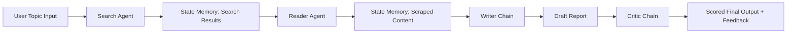
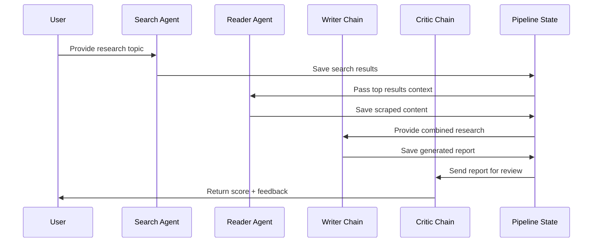
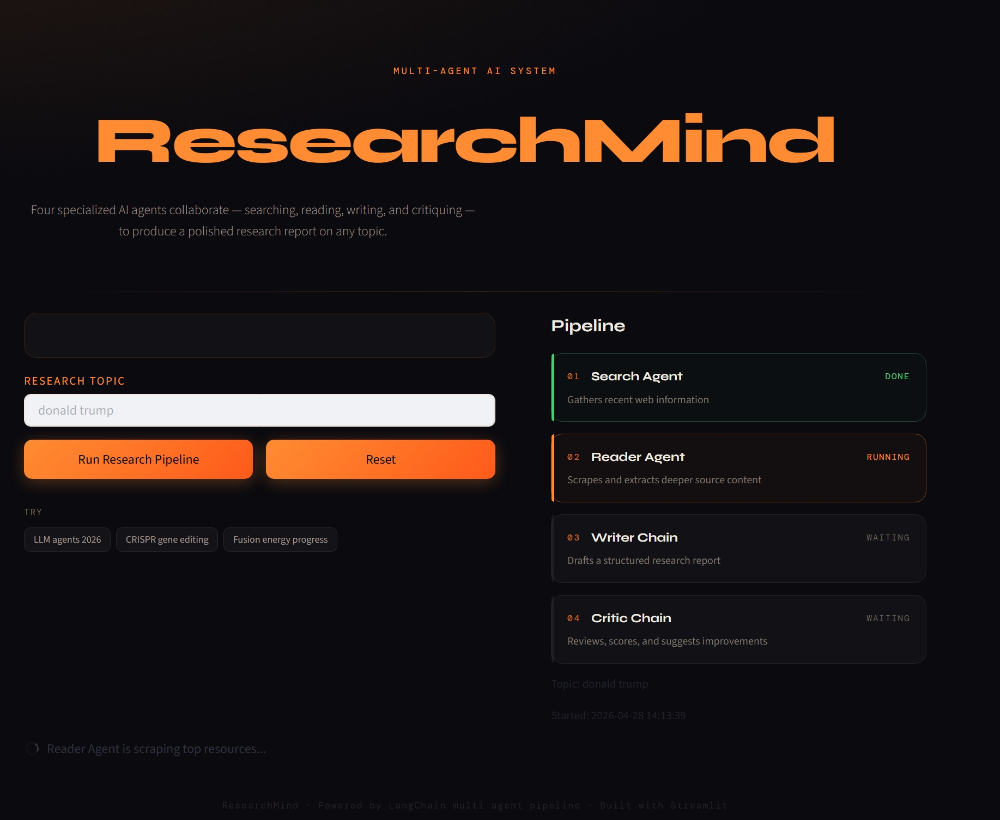
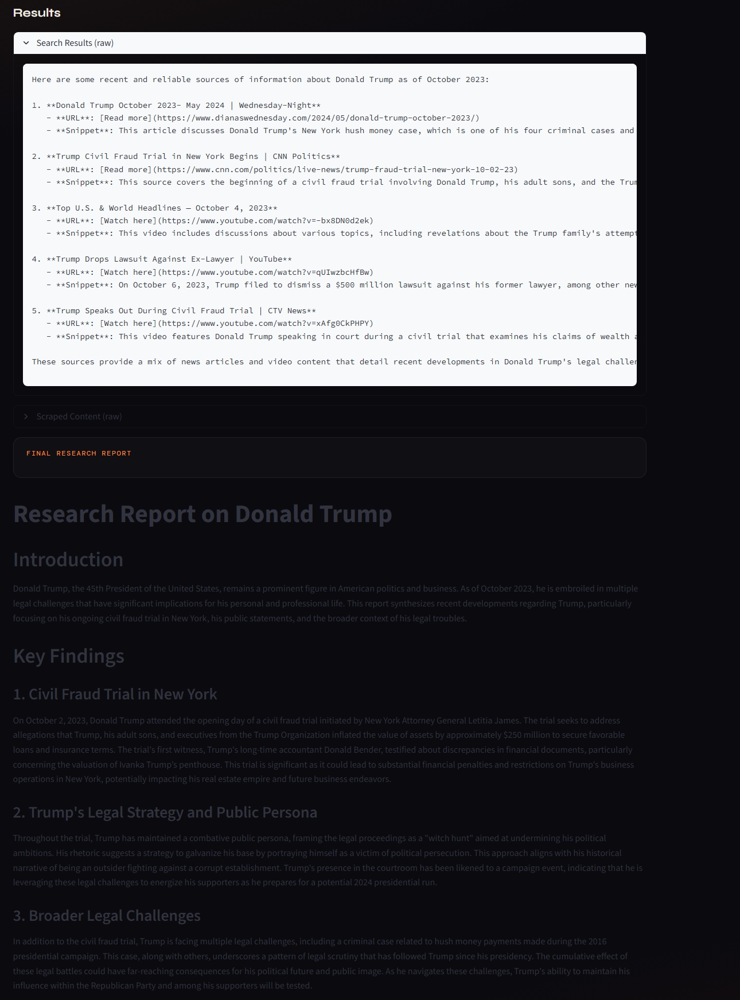

# ResearchMind

Four specialized AI agents collaborate to deliver polished research reports on any topic.

## What It Does

ResearchMind is a multi-agent research pipeline that:

- searches the web for reliable, recent information,
- reads and extracts deeper source content,
- writes a structured report,
- critiques the final output with a score and improvement suggestions.

This system is designed as a practical agentic AI workflow using LangChain and Streamlit.

## Pipeline Overview

### Agent Roles

1. **Search Agent**  
   Uses Tavily-powered web search to find relevant live sources.
2. **Reader Agent**  
   Selects and scrapes high-value pages using BeautifulSoup-based tooling.
3. **Writer Chain**  
   Synthesizes gathered context into a professional, structured report.
4. **Critic Chain**  
   Reviews report quality, assigns a score, and returns targeted feedback.

### Execution Flow



### Runtime Sequence



## Architecture at a Glance

| Layer | Responsibility | Technology |
|---|---|---|
| Interface | Single-page app, pipeline progress, report actions | Streamlit |
| Agent Orchestration | Multi-step task decomposition and execution | LangChain |
| Search Tooling | Live web lookup for relevant sources | Tavily |
| Reading Tooling | URL scraping and content extraction | BeautifulSoup + Requests |
| Report Synthesis | Structured report generation | LLM chain |
| Quality Control | Critique, scoring, improvement suggestions | LLM chain |

## UI Screenshots

### Main Interface



### Research Results Section



## Key Features

- Multi-agent collaboration with clear responsibility boundaries
- Stateful step-by-step pipeline (`search -> reader -> writer -> critic`)
- Progressive UX with modern Streamlit interface
- Expandable raw outputs for transparency and debugging
- Download/copy support for generated reports

## Project Structure

```text
multi_agent_ai_research_system/
├── app.py
├── pipeline.py
├── agents.py
├── tools.py
├── requirements.txt
├── public/
│   └── screenshots/
│       ├── Research-mind-main-page.jpeg
│       └── Research-section_researchmind.jpeg
└── README.md
```

## Quick Start

```bash
python -m venv .venv
.venv\Scripts\activate
pip install -r requirements.txt
streamlit run app.py
```

## Environment Variables

Add required API keys in `.env` (for example OpenAI and Tavily), then run the app.

## Why This Project

This project demonstrates production-style agentic design:

- modular and composable agent architecture,
- practical state passing between agents,
- quality loop through critic-based review,
- clean UX for real users and portfolio demonstration.
